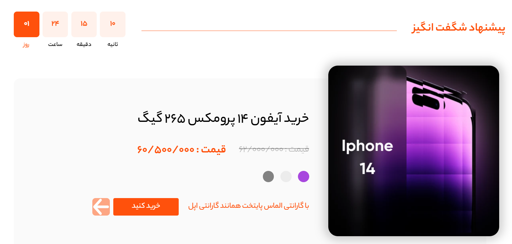
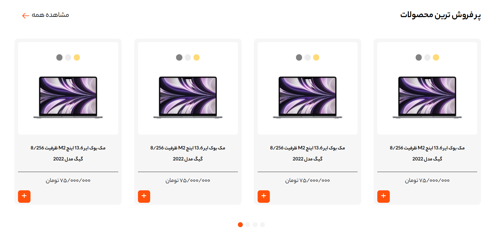

# 🍎 Apple Store Website

A simple Apple Store inspired e-commerce website  
Built using **HTML** and **Tailwind CSS** only  
Focused entirely on UI and layout, with no JavaScript logic.

---

## 📸 Project Preview

---

## ✨ Project Description

This project is a static e-commerce website called **Apple Store**, created to practice modern UI design using **Tailwind CSS**.

Key highlights:
- No JavaScript logic used
- Dropdown menu implemented using Tailwind’s `peer` utility
- Fully focused on layout, styling, and responsiveness
- Clean and minimal UI inspired by Apple’s design language

---

## 🛠 Technologies Used
- HTML5  
- Tailwind CSS  

---

## 🎯 Project Goal
The main goal of this project is to improve UI design skills and gain hands-on experience with Tailwind CSS by building a real-world styled website without JavaScript.

---

## 📌 Notes
This project does not include:
- JavaScript
- Backend
- Dynamic functionality

It is purely a UI-focused project.
